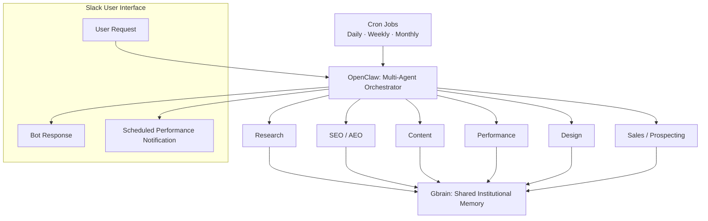

# Futi — Multi-Agent Architecture for Growth Marketing

> Operational architecture document for Futi and its six specialized agents.  
> Format: GitHub-compatible Markdown.

## 1. What Futi Is

Futi is a multi-agent orchestrator designed for growth marketing agencies. It is not a general-purpose chatbot and it does not replace the team. Futi receives requests, retrieves the right client context, coordinates specialized capabilities, uses approved services, and returns traceable deliverables.

Futi works through **six specialized agents**:

| Agent | Main Function |
|---|---|
| Research Agent | Conducts market, customer, and competitor research across multiple data sources. Synthesizes findings into structured intelligence that informs strategy and decision making. |
| SEO / AEO Agent | Analyzes search demand, content gaps, keywords, and AI search visibility. Optimizes content and technical signals to improve rankings and inclusion across search and answer engines. |
| Content Agent | Converts research and strategic inputs into structured content across channels and formats. Uses audience, intent, and performance data to continuously improve content quality and relevance. |
| Performance Agent | Monitors campaign, funnel, and channel performance across paid and owned media. Identifies anomalies, attribution gaps, and optimization opportunities to improve efficiency and ROI. |
| Design Agent | Translates strategic and content inputs into visual assets and digital experiences. Applies brand systems, UX principles, and performance insights to guide creative production. |
| Sales / Prospecting Agent | Identifies and researches target accounts and relevant decision makers using firmographic and behavioral signals. Enriches and qualifies prospects to support personalized outreach and pipeline generation. |

This model is designed for a retainer-based agency. A request may begin with a client, campaign, meeting, metric, task, or prospect; the resulting knowledge is returned to institutional memory rather than remaining in a chat, document, or one person’s head.

Futi supports the following core growth marketing service lines:

- Conversion rate optimization (CRO) and funnel design.
- Paid media management and optimization.
- SEO, AEO, and AI-search visibility.
- Organic, social, paid, and web content.
- Analytics, reporting, and client intelligence.
- Prospecting and commercial audits.

## 2. Architecture

Futi uses a hub-and-spoke architecture: **OpenClaw** is the runtime and orchestration layer; **Gbrain** is the shared institutional memory; and the six agents perform focused work. The orchestrator decides which context, agent, and service are needed for a request. No single agent is expected to do everything.



### Scheduled performance notifications

OpenClaw can run cron tasks that generate performance-related notifications in Slack on a **daily, weekly, or monthly** cadence. These notifications can cover **organic content** or **paid media** performance for each client.

### Why this separation matters

- **Specialization:** every agent has a defined mission, inputs, outputs, tools, and quality controls.
- **Shared memory:** useful research, decisions, and learnings are available to the full system.
- **Traceability:** significant claims can be connected to a source, client, and date.
- **Multi-client scale:** the same architecture can support Kadance, Blue Spirit, Rodrigo Castillo, and future clients; the context and authorized connections vary by client.
- **Human control:** the team owns prioritization and final decisions, especially for sensitive, public, or external-facing work.

### 2.1 OpenClaw: runtime and orchestration

OpenClaw is the environment that receives messages and executes work. It connects Futi to Slack, manages sessions, tools, permissions, scheduled work, and external connectors.

In practice, OpenClaw enables Futi to:

1. Receive a request through Slack.
2. Identify the channel, authenticated requester, and permitted scope.
3. Select the relevant agent(s), skills, and services.
4. Maintain working context across the task.
5. Return a result without exposing credentials or private client data.

Permissions are part of the architecture. Not every user can write canonical knowledge or use the same integrations. External actions — such as publishing, sending, or deleting — require explicit scope and authorization.

### 2.2 Gbrain: institutional memory and Client Intelligence Layer

Gbrain is the shared knowledge layer. It stores structured Markdown pages for people, clients, projects, meetings, concepts, and decisions. Those pages are indexed for semantic retrieval and are consulted before Futi answers or investigates a relevant subject.

Gbrain is the practical implementation of a **Client Intelligence Layer**:

- It consolidates client, project, and stakeholder context.
- It connects decisions, meetings, metrics, and research.
- It preserves sources and dates so a hypothesis is not confused with a fact.
- It enables retrieval by entity name or natural-language question.
- It prevents the team from rebuilding each client brief from scratch.

Operational rule: for a relevant entity, Futi checks Gbrain first. External sources fill gaps; they do not replace internal context. Confirmed new information is written back with attribution, owner, and date.

### 2.3 Skills and connectors: capabilities and data

Agents do not depend on one API. Each combines reusable **skills** — operational procedures — with connectors that read data or execute authorized actions. This makes the system modular: a source can be added or changed without rebuilding the agent itself.

Services used across the operating system include:

- **Slack:** main interface for the team.
- **Google Drive and Google Docs:** working documentation.
- **Fathom:** meetings and transcripts.
- **Asana:** tasks, projects, and operational follow-up.
- **GA4 and Meta Marketing API:** website and paid-media measurement.
- **Metricool:** social calendar and performance context.
- **Mailchimp:** audiences, campaigns, reports, and automations.
- **SerpAPI and Ubersuggest:** SERP, search, and SEO signals.
- **Apify:** targeted public-data extraction, such as Instagram comments.
- **Webflow:** site and collection data where permissions permit.
- **Figma:** design files and visual systems when required.
- **OpenAI:** language models and embedding-based retrieval.

Availability and write permissions vary by client and connector. A connection is never assumed to be writable simply because it exists.

## 3. The Six Agents

### 3.1 Research Agent

**Role:** turns market, competitor, ICP, trend, and opportunity questions into usable research.

**What it does**

- Defines the research question and evidence standard.
- Reviews the client’s internal context before looking externally.
- Investigates public sources and validates relevant data.
- Produces cited notes, synthesis, and bibliography.
- Promotes reusable findings into Gbrain.

**Inputs:** client brief, URLs, competitors, hypotheses, team questions, and Gbrain context.

**Outputs:** research notes, competitive benchmarks, ICP profiles, opportunity analysis, and verifiable sources.

**Primary services:** Gbrain, web research, SerpAPI/Ubersuggest, Google Drive, and public sources.

**Relationship to other agents:** provides the evidence base for SEO / AEO, Content, Performance, and Sales / Prospecting.

### 3.2 SEO / AEO Agent

**Role:** owns discoverability across keywords, editorial and technical SEO, and visibility in AI-assisted search experiences.

**What it does**

- Builds and maintains keyword maps by client and search intent.
- Reviews SERPs, competitors, content opportunities, and gaps.
- Recommends metadata, page structure, internal linking, and schema.
- Connects search demand with landing pages, content, and paid media.
- Maintains one shared discoverability dataset per client.

**Inputs:** domains, pages, competitors, ICP, research, and search data.

**Outputs:** keyword maps, SEO / AEO gap analysis, backlogs, and recommendations for content, CRO, and paid media.

**Primary services:** Gbrain, SerpAPI/Ubersuggest, GA4, Webflow where available, and web sources.

**Relationship to other agents:** receives research and supplies priorities to Content, Performance, and Sales / Prospecting.

### 3.3 Content Agent

**Role:** turns strategy, research, and performance learning into organic, paid, and web content.

**What it does**

- Produces briefs, outlines, and Markdown drafts.
- Adapts voice, claims, restrictions, and audience by client.
- Creates hooks, CTAs, and platform variants for testing.
- Translates keyword maps and campaign insights into editorial angles.
- Preserves a human review step before publishing.

**Inputs:** sprint plan, brief, brand voice, keyword map, research, performance data, and team/client feedback.

**Outputs:** copy, briefs, variants, calendars, and review-ready content documentation.

**Primary services:** Gbrain, Google Drive, Slack, Asana, approved brand sources, and client publishing systems where available.

**Relationship to other agents:** consumes Research, SEO / AEO, and Performance; sends production-ready copy to Design and publishing workflows.

### 3.4 Performance Agent

**Role:** turns organic and paid data into decisions, rather than dashboards alone.

**What it does**

- Reads available campaign and channel metrics.
- Detects anomalies, winners, declines, and patterns.
- Separates observation from conclusion and attaches evidence to each insight.
- Produces weekly summaries, monthly reviews, and prioritized recommendations.
- Returns learning to Content, SEO / AEO, and the client’s memory layer.

**Inputs:** goals, date ranges, campaigns, conversion events, content calendar, and benchmarks.

**Outputs:** reports, alerts, optimization hypotheses, top-performer analysis, and prioritized recommendations.

**Primary services:** Meta Marketing API as the source of record for live paid metrics, GA4, Metricool as supporting context, Mailchimp where relevant, Gbrain, and Asana.

**Relationship to other agents:** identifies messages, formats, keywords, and audiences to repeat, adjust, or stop.

### 3.5 Design Agent

**Role:** reduces friction between approved copy and visual production while respecting each client’s design system.

**What it does**

- Receives approved copy and format specifications.
- Fits text to character limits, hierarchy, and template slots.
- Prepares variants for social formats, ads, landing assets, or campaign pieces.
- Works with connected design files and systems when authorized.
- Delivers production-ready material for human designer review and decision.

**Inputs:** template, format, copy, brand guidelines, and platform constraints.

**Outputs:** design specifications, slot-ready copy, and production/review variants.

**Primary services:** Figma where connected, Google Drive, Slack, and Gbrain for brand voice and constraints.

**Relationship to other agents:** receives from Content and delivers a clearer handoff to the design and publishing process.

### 3.6 Sales / Prospecting Agent

**Role:** turns a target company into a clear, evidence-based commercial audit.

**What it does**

- Reviews the website, search visibility, content, social presence, and public paid signals.
- Identifies specific gaps in CRO, SEO / AEO, paid media, content, and measurement.
- Converts evidence into a commercial narrative.
- Produces a versionable audit or briefing for team review before it is sent externally.

**Inputs:** prospect URL, competitors, vertical, commercial objective, and public channels.

**Outputs:** diagnosis, opportunity hypotheses, cited research, and material for a PDF or proposal.

**Primary services:** Gbrain to avoid duplicated context, Research, SEO / AEO, SerpAPI/Ubersuggest, Apify where appropriate, Google Drive, and document/PDF tooling.

**Relationship to other agents:** coordinates research and discoverability work, then owns the final commercial narrative.

## 4. How Information Flows

A standard workflow starts with a business question, not a tool:

```text
Request: “What did we learn from x campaigns this month?”
  → Futi identifies the client and decision needed
  → Gbrain retrieves context, decisions, and constraints
  → Performance checks live metrics and the selected period
  → Research / SEO are called only if market or search context is required
  → Futi returns evidence, recommendation, and next step
  → Reusable insight is saved in Gbrain with source and date
```

A prospecting workflow follows the same pattern:

```text
New prospect
  → Sales / Prospecting defines the hypothesis and scope
  → Research studies market and competitors
  → SEO / AEO reviews demand and visibility
  → Performance reviews available public signals
  → Sales / Prospecting composes the audit and proposal
  → Human review occurs before any external delivery
```

## 5. Governance, Quality, and Security

The architecture includes controls so automation improves quality rather than diluting it:

- **Brain-first:** relevant client and project context is retrieved before making material claims.
- **Evidence:** meaningful research and data points include source and date.
- **Read/write separation:** many integrations are read-only; external actions require authorization.
- **Identity-based permissions:** access depends on the authenticated user and channel, not a display name.
- **Human review:** public content, sensitive claims, campaign changes, and external communications are not published by default.
- **Traceability:** knowledge updates record owner, origin, and date.
- **Safe multi-client operation:** context is retrieved by entity and project to avoid mixing client information.

## 6. Current State and Evolution

The current system implements the foundational architecture: Futi as orchestrator, OpenClaw as the runtime, Gbrain as shared memory, six specialized agent domains, Slack as the main interface, and an operating set of marketing and knowledge connectors.

The next stage is not a “super-agent.” It is the continued improvement of each domain: more authorized connectors, stronger client data schemas, scheduled automations, and better quality controls. This modular design supports additional clients and capabilities without losing the core operating principle: accumulated knowledge, verifiable evidence, and humans accountable for decisions.

---

*This README documents the operating architecture. It intentionally excludes secrets, tokens, and client-specific credentials.*


